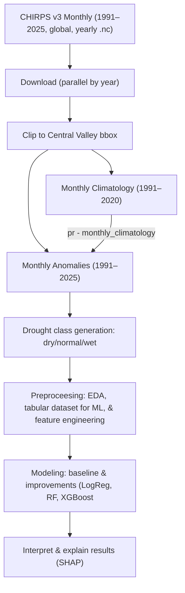

# 🌦️ Central Valley Drought Classifier
**Predicting drought conditions from CHIRPS precipitation using machine learning**

---

## 🧭 Project Overview

This project builds a **machine learning pipeline** to predict **monthly drought classes** — *Dry*, *Normal*, or *Wet* — for **California’s Central Valley (1991–2025)** using **CHIRPS v3.0 satellite precipitation data**.

It integrates a full scientific workflow:  
> Data acquisition → Climate preprocessing → Feature engineering → Label generation → Model training → Explainability (SHAP)

**Goal:** Develop a robust, interpretable, and scalable drought prediction system that can support regional agricultural and water-management decisions.

---

## 📍 Study Region
**Central Valley, California (USA)**  
- Latitude: 35.4° N – 40.6° N  
- Longitude: −122.5° W – −119.0° W  
- Major crops: almonds, grapes, citrus — highly drought-sensitive  

- **Why CHIRPS here?:** Good statistics on blending, strong monthly skill, long record.

---

## 🧩 Data & Sources
| Dataset | Description | Temporal Range | Resolution |
|----------|--------------|----------------|-------------|
| **CHIRPS v3.0 Monthly** | Climate Hazards Group InfraRed Precipitation with Station data | 1991 – 2025 | 0.05° (~5 km) |
| **Derived Climatology** | 1991 – 2020 monthly mean baseline | — | Same |
| **Anomalies** | Monthly deviation from climatology | 1991 – 2025 | Same |

Data were downloaded programmatically via parallel bash scripts and processed with **xarray**, ensuring full reproducibility.

---

## Project Structure
```
central-valley-drought-classifier/
├── README.md
├── environment.yml
├── data/               # (add .gitkeep) raw/ and processed/ CHIRPS files (not committed)
├── notebooks/          # EDA, modeling, evaluation
├── scripts/            # helper scripts (preprocessing, labeling)
└── outputs/            # figures, maps, metrics (not committed)
```

---

## 🧮 Pipeline


---

## Monthly climatology and anomalies
**Climatology baseline:** 1991–2020 (first 30 years).
**Anomalies:** full time span 1991–2025 relative to that climatology.

---

## Labeling Strategy
Use anomalies over the 1991–2020 baseline to compute thresholds (20th & 80th percentile anomaly).

- **Dry:** anomaly ≤ 20th percentile  
- **Normal:** between 20th – 80th percentile  
- **Wet:** anomaly ≥ 80th percentile  
→ computed per pixel × month across the 1991–2020 baseline.

Final labeled dataset: **3,021,200 samples × 12 columns**

---

## ⚙️ Feature Engineering
| Feature | Description |
|----------|--------------|
| `pr` | Monthly precipitation (mm) |
| `pr_anom` | Precipitation anomaly |
| `anom_lag1`, `anom_lag3` | 1- and 3-month lagged anomalies |
| `month_sin`, `month_cos` | Cyclic seasonal encoding |
| `year` | Calendar year (for analysis only) |

---

## Key Data Artifacts (Preprocessing)

| File Path                                                      | Description                                                                      | Dimensions                        |
| -------------------------------------------------------------- | -------------------------------------------------------------------------------- | --------------------------------- |
| `data/processed/chirps_v3_monthly_cvalley_1991_2025.nc`        | Regional subset of  v3 monthly precipitation for  (1991–2025)                    | time × lat × lon (415 × 104 × 70) |
| `data/processed/chirps_v3_monthly_cvalley_clim_1991_2020.nc`   | Long-term monthly climatology (1991–2020 baseline means)                         | month × lat × lon (12 × 104 × 70) |
| `data/processed/chirps_v3_monthly_cvalley_anom_1991_2025.nc`   | Monthly precipitation anomalies (actual − climatology)                           | time × lat × lon (415 × 104 × 70) |
| `data/processed/chirps_v3_monthly_cvalley_labels_1991_2025.nc` | Drought class labels (dry / normal / wet) with 20th / 80th percentile thresholds | time × lat × lon (415 × 104 × 70) |
| `outputs/drought_shares.csv`                                   | Monthly fraction of the region in each drought class                             | time × 3 classes                  |
| `outputs/drought_shares_stacked.png`                           | Stacked area plot of dry / normal / wet area shares over time                    | —                                 |
| `outputs/drought_map_YYYY-MM.png`                              | Spatial drought class map for selected months                                    | lat × lon                         |

---

## 🧠 Modeling
### Train/val/test split (time-based)
    * **A temporal split (no shuffling by default):**
        * **Train:** earliest block of years (≈ 26 years)
        * **Validation:** next ~4 years
        * **Test:** 2021–2025 (400 k grid-month samples)

| Model | Accuracy | Macro F1 | Key Takeaways |
|-------|-----------|----------|----------------|
| **Logistic Regression** | 0.786 | 0.795 | Linear baseline; limited for nonlinear rainfall–drought patterns |
| **Random Forest** | 0.889 | 0.883 | Captures nonlinearities; strong feature ranking |
| **XGBoost (GPU)** | **0.908** | **0.895** | Best performer — fast, robust, interpretable |

Models were trained on past climate, validated on recent years, and tested on the most recent period.

---

## 📊 Model Performance
**Confusion Matrix (XGBoost)**  

| True \ Pred | Dry | Normal | Wet |
|--------------|------|--------|------|
| **Dry (−1)** | **78.6 %** | 21.4 % | 0 % |
| **Normal (0)** | 3.1 % | **96.0 %** | 0.9 % |
| **Wet (1)** | 0.1 % | 12.0 % | **87.9 %** |

**Interpretation**
- Minimal confusion between dry ↔ wet classes  
- Strong separation across categories  
- Excellent generalization on unseen years  

---

## 🔍 Feature Importance (XGBoost)
| Rank | Feature | Importance (weight) |
|------|----------|----------------------|
| 1 | **`pr_anom`** | 0.61 |
| 2 | `pr` | 0.24 |
| 3 | `month_cos` | 0.06 |
| 4 | `month_sin` | 0.05 |
| 5 | `anom_lag3` | 0.03 |
| 6 | `anom_lag1` | 0.02 |

> Precipitation and its deviation from climatology dominate — aligning perfectly with hydrological intuition.

---

## 🧩 Explainability with SHAP
We used **SHAP (SHapley Additive exPlanations)** to interpret the XGBoost model, focusing on *dry-class probability*.

### 🔹 Global Importance
- `pr_anom` and `pr` jointly account for > 60 % of model variance.  
- Seasonal features (`month_cos`, `month_sin`) refine classification near seasonal transitions.  
- Lagged anomalies offer minor yet useful temporal memory.

### 🔹 Feature Effects
- **Negative precipitation anomalies** sharply increase drought probability.  
- **Positive anomalies** reduce drought likelihood.  
- Clear **nonlinear threshold** near zero anomaly — small deficits rapidly trigger drought predictions.  
- Interaction (`pr` × `pr_anom`) amplifies drought risk under already dry baseline rainfall.

### 🔹 SHAP Plots (from analysis)
- `xgb_shap_summary_bar.png` – global feature importance  
- `xgb_shap_summary_beeswarm.png` – feature-level contributions  
- `xgb_shap_dependence_pr_anom_dry.png` – non-linear anomaly effect  

**Insight:**  
> The model learned physically consistent relationships — not statistical artifacts — confirming scientific interpretability.

---

## 🧱 Reproducibility
All steps are reproducible via modular scripts:

| Stage | Script | Output |
|--------|---------|--------|
| Download CHIRPS | `scripts/download_chirps_v3_monthly_1991_2025.sh` | `data/raw/*.nc` |
| Clip to Region | `scripts/clip_to_cvalley_monthly.py` | Clipped NetCDF |
| Climatology & Anomalies | `scripts/make_climatology_and_anomalies.py` | `..._clim_1991_2020.nc`, `..._anom_1991_2025.nc` |
| Label Generation | `scripts/make_drought_labels.py` | `..._labels_1991_2025.nc` |
| Tabular Dataset | `scripts/build_dataset_baseline.py` | `dataset_baseline.parquet` |
| Modeling | `scripts/train_baseline_logreg.py`, `train_rf_full.py`, `train_xgb_baseline.py` | metrics + plots |
| Explainability | `scripts/shap_anal.py` | SHAP visualizations |

---

## 🧾 Key Takeaways
- XGBoost achieved **> 90 % accuracy** with interpretable drivers  
- `pr_anom` (rainfall deviation) is the **most influential feature**  
- Model behavior matches known drought dynamics  
- Workflow is fully reproducible and ready for scaling 

---


## Acknowledgement
Used AI tools (ChatGpt & Gemini) to design, improve, and test code.

## References
- CHIRPS: Climate Hazards Group, UCSB — https://www.chc.ucsb.edu/data/chirps

