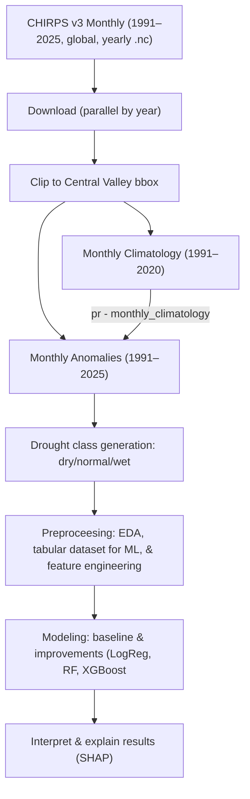
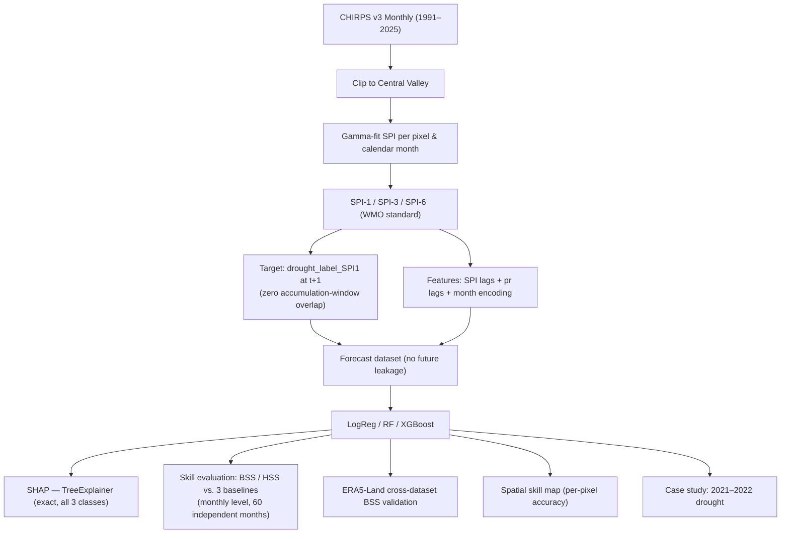

# 🌦️ Central Valley Drought Classifier
**Predicting drought conditions from CHIRPS precipitation using machine learning**

> **v3 (Publication-Ready Pipeline)** — The pipeline has been upgraded to Q1/Q2 journal standards: SPI-1 target eliminates accumulation-window overlap, all primary metrics are reported at the monthly level (60 independent test months), and BSS/HSS skill scores are benchmarked against three naive baselines. See [v3: Publication-Ready Pipeline](#v3-publication-ready-pipeline) for details.

---

## 🧭 Project Overview

This project builds a **machine learning pipeline** to predict **monthly drought classes** — *Dry*, *Normal*, or *Wet* — for **California’s Central Valley (1991–2025)** using **CHIRPS v3.0 raing gauge and satellite precipitation data**.

It integrates a full scientific workflow:  
> Data acquisition → Climate preprocessing → Feature engineering → Label generation → Model training → Explainability (SHAP)

**Goal:** Develop a robust, interpretable, and scalable drought prediction system that can support regional agricultural and water-management decisions.

---

## 📍 Study Region
**Central Valley, California (USA)**  
>- Latitude: 35.4° N – 40.6° N  
>- Longitude: −122.5° W – −119.0° W  
>- Major crops: almonds, grapes, citrus — highly drought-sensitive  

**Why CHIRPS here?:** Good statistics on blending, strong monthly skill, long record.

---

## 🧩 Data & Sources
| Dataset | Description | Temporal Range | Resolution |
|----------|--------------|----------------|-------------|
| **[CHIRPS v3.0 Monthly](https://www.chc.ucsb.edu/data/chirps3)** | Climate Hazards Group InfraRed Precipitation with Station data | 1991 – 2025 | 0.05° (~5 km) |
| **Derived Climatology** | 1991 – 2020 monthly mean baseline | — | Same |
| **Anomalies** | Monthly deviation from climatology | 1991 – 2025 | Same |

Data were downloaded programmatically via parallel bash scripts and processed with **xarray**, ensuring full reproducibility.

---

## 📂 Project Structure
```
central-valley-drought-classifier/
├── README.md
├── environment.yml
├── data/               # (add .gitkeep) raw/ and processed/ CHIRPS files (not committed)
├── notebooks/          # EDA, modeling, evaluation
├── scripts/            # helper scripts (preprocessing, labeling)
└── outputs/            # figures, maps, metrics (not committed)
```

---

## 🧮 Pipeline

```mermaid
graph TD;
    A["CHIRPS v3 Monthly (1991–
2025, global, yearly .nc)"] --> B["Download (parallel by year)"];
    B --> C["Clip to Central Valley bbox"];
    
    %% This is the key branching part
    C --> D["Monthly Climatology (1991–
2020)"];
    C --> E["Monthly Anomalies (1991–
2025)"];
    
    %% This is the calculation step
    D --> |"pr - monthly_climatology"| E;
    
    %% This is the rest of the flow
    E --> F["Drought class generation: dry/normal/wet"];
    F --> G["Preproceesing: EDA, tabular dataset for ML, & feature engineering"]
    G --> H["Modeling: baseline & improvements (LogReg, RF, XGBoost"];
    H --> I["Interpret & explain results (SHAP)"]
```

---
## 🔍 Preprocessing
### Monthly climatology and anomalies
**Climatology baseline:** 1991–2020 (first 30 years).
**Anomalies:** full time span 1991–2025 relative to that climatology.

### 🔹 Labeling Strategy
Use anomalies over the 1991–2020 baseline to compute thresholds (20th & 80th percentile anomaly).

>- **Dry:** anomaly ≤ 20th percentile  
>- **Normal:** between 20th – 80th percentile  
>- **Wet:** anomaly ≥ 80th percentile  
→ computed per pixel × month across the 1991–2020 baseline.

Final labeled dataset: **3,021,200 samples × 12 columns**

### 🔹 Feature Engineering
| Feature | Description |
|----------|--------------|
| `pr` | Monthly precipitation (mm) |
| `pr_anom` | Precipitation anomaly |
| `anom_lag1`, `anom_lag3` | 1- and 3-month lagged anomalies |
| `month_sin`, `month_cos` | Cyclic seasonal encoding |
| `year` | Calendar year (for analysis only) |

### 🔹 Key Data Artifacts

| File Path                                                      | Description                                                                      | Dimensions                        |
| -------------------------------------------------------------- | -------------------------------------------------------------------------------- | --------------------------------- |
| `data/processed/chirps_v3_monthly_cvalley_1991_2025.nc`        | Regional subset of  v3 monthly precipitation for  (1991–2025)                    | time × lat × lon (415 × 104 × 70) |
| `data/processed/chirps_v3_monthly_cvalley_clim_1991_2020.nc`   | Long-term monthly climatology (1991–2020 baseline means)                         | month × lat × lon (12 × 104 × 70) |
| `data/processed/chirps_v3_monthly_cvalley_anom_1991_2025.nc`   | Monthly precipitation anomalies (actual − climatology)                           | time × lat × lon (415 × 104 × 70) |
| `data/processed/chirps_v3_monthly_cvalley_labels_1991_2025.nc` | Drought class labels (dry / normal / wet) with 20th / 80th percentile thresholds | time × lat × lon (415 × 104 × 70) |
| `outputs/drought_shares.csv`                                   | Monthly fraction of the region in each drought class                             | time × 3 classes                  |
| `outputs/drought_shares_stacked.png`                           | Stacked area plot of dry / normal / wet area shares over time                    | —                                 |
| `outputs/drought_map_YYYY-MM.png`                              | Spatial drought class map for selected months                                    | lat × lon                         |

---

## 🧠 Modeling
### 🔹 Train/val/test split (time-based)
    >- **A temporal split (no shuffling by default):**
    >→ **Train:** earliest block of years (≈ 26 years)
    >→ **Validation:** next ~4 years
    >→ **Test:** 2021–2025 (400 k grid-month samples)

| Model | Accuracy | Macro F1 | Key Takeaways |
|-------|-----------|----------|----------------|
| **Logistic Regression** | 0.786 | 0.795 | Linear baseline; limited for nonlinear rainfall–drought patterns |
| **Random Forest** | 0.889 | 0.883 | Captures nonlinearities; strong feature ranking |
| **XGBoost (GPU)** | **0.908** | **0.895** | Best performer — fast, robust, interpretable |

Models were trained on past climate, validated on recent years, and tested on the most recent period.

---

## 📊 Final Model Performance Analysis
### 🔹 Confusion Matrix (XGBoost)

| True \ Pred | Dry | Normal | Wet |
|--------------|------|--------|------|
| **Dry (−1)** | **78.6 %** | 21.4 % | 0 % |
| **Normal (0)** | 3.1 % | **96.0 %** | 0.9 % |
| **Wet (1)** | 0.1 % | 12.0 % | **87.9 %** |

**Interpretation**
>- Minimal confusion between dry ↔ wet classes  
>- Strong separation across categories  
>- Excellent generalization on unseen years  

### 🔹 Feature Importance (XGBoost)
| Rank | Feature | Importance (gain) |
|------|----------|----------------------|
| 1 | **`pr_anom`** | 0.61 |
| 2 | `pr` | 0.24 |
| 3 | `month_cos` | 0.06 |
| 4 | `month_sin` | 0.05 |
| 5 | `anom_lag3` | 0.03 |
| 6 | `anom_lag1` | 0.02 |

Precipitation and its deviation from climatology dominate — aligning perfectly with hydrological intuition.

---

## 🧩 Explainability with SHAP
We used **SHAP (SHapley Additive exPlanations)** to interpret the XGBoost model, focusing on *dry-class probability*.

### 🔹 Global Importance
>- `pr_anom` and `pr` jointly account for > 60 % of model variance.  
>- Seasonal features (`month_cos`, `month_sin`) refine classification near seasonal transitions.  
>- Lagged anomalies offer minor yet useful temporal memory.

### 🔹 Feature Effects
>- **Negative precipitation anomalies** sharply increase drought probability.  
>- **Positive anomalies** reduce drought likelihood.  
>- Clear **nonlinear threshold** near zero anomaly — small deficits rapidly trigger drought predictions.  
>- Interaction (`pr` × `pr_anom`) amplifies drought risk under already dry baseline rainfall.

### 🔹 SHAP Plots (from analysis)
>- `xgb_shap_summary_bar.png` – global feature importance  
>- `xgb_shap_summary_beeswarm.png` – feature-level contributions  
>- `xgb_shap_dependence_pr_anom_dry.png` – non-linear anomaly effect  
  
The model learned physically consistent relationships — not statistical artifacts — confirming scientific interpretability.

---

## 🧱 Reproducibility
All steps are reproducible via modular scripts:

### v1 (Baseline — label reconstruction)

| Stage | Script | Output |
|--------|---------|--------|
| Download CHIRPS | `scripts/download_chirps_v3_monthly_1991_2025.sh` | `data/raw/*.nc` |
| Clip to Region | `scripts/clip_to_cvalley_monthly.py` | Clipped NetCDF |
| Climatology & Anomalies | `scripts/make_climatology_and_anomalies.py` | `..._clim_1991_2020.nc`, `..._anom_1991_2025.nc` |
| Label Generation | `scripts/make_drought_labels.py` | `..._labels_1991_2025.nc` |
| Tabular Dataset | `scripts/build_dataset_baseline.py` | `dataset_baseline.parquet` |
| Modeling | `scripts/train_baseline_logreg.py`, `train_baseline_random_forest.py`, `train_baseline_xgboost.py` | metrics + plots |
| Explainability | `scripts/xgb_shap_analysis.py` | SHAP visualizations |

### v2/v3 (Forecasting Pipeline — see section below)

| Stage | Script | Output |
|--------|---------|--------|
| SPI Labels | `scripts/make_spi_labels.py` | `..._spi_1991_2025.nc` (spi1/3/6 + `drought_label_spi1/spi3`) |
| Forecast Dataset | `scripts/build_dataset_forecast.py` | `dataset_forecast.parquet` (target = SPI-1[t+1]) |
| Forecast Models | `scripts/train_forecast_logreg.py`, `train_forecast_rf.py`, `train_forecast_xgboost.py` | metrics + val metrics + plots |
| SHAP (TreeExplainer) | `scripts/xgb_shap_forecast_analysis.py` | SHAP visualizations |
| **Skill Evaluation** | `scripts/evaluate_forecast_skill.py` | BSS/HSS table, reliability diagram, monthly CM |
| USDM Consistency | `scripts/validate_usdm.py` | `usdm_consistency.png` (qualitative only) |
| **ERA5 Cross-validation** | `scripts/validate_era5_spi.py` | `era5_validation_metrics.txt`, comparison plot |
| Regional Evaluation | `scripts/evaluate_regional_forecast.py` | `regional_forecast_comparison.png` |
| **Spatial Skill Map** | `scripts/plot_spatial_skill.py` | `spatial_skill_accuracy.nc/.png` |
| **Case Study** | `scripts/plot_case_study.py` | `case_study_2021_2025.png` |

---

## 🚀 v3: Publication-Ready Pipeline

### Why v3? (building on v2)

The v2 forecasting pipeline had three residual scientific issues:

1. **SPI-3 accumulation overlap (v3 fix → SPI-1 target):** Target = SPI-3[t+1] = f(pr[t-1], pr[t], pr[t+1]). Features already include pr[t], pr[t-1], and spi3[t] = f(pr[t-2..t]), so the model only needed to "guess" pr[t+1] — making the task trivially easy. The fix is to use **SPI-1[t+1]** as the target: SPI-1 depends only on pr[t+1], which is entirely unknown from the feature set at t. This is the standard choice in published 1-month-ahead drought forecasting (Dikshit et al. 2021, *Sci. Total Environ.*).
2. **Spatial pseudo-replication (v3 fix → monthly-level metrics):** Pixel-level accuracy over ~400k rows treats spatially autocorrelated pixels as independent samples (effective df ≈ 60 monthly maps, not 400k rows). All primary metrics are now reported at the monthly level using Brier Skill Score (BSS) and Heidke Skill Score (HSS).
3. **No baseline comparison (v3 fix → 3 naive baselines):** Without a baseline, accuracy figures have no scientific meaning. Three naive forecasters (climatological, persistence, SPI-1 threshold rule) are now included in the skill table.

### Why v2? (building on v1)

The v1 baseline had two scientific limitations that inflated model accuracy:

1. **Percentile-based labels vs. SPI:** The 20th/80th percentile thresholds are dataset-specific and not comparable across regions or studies. WMO-standard SPI is the internationally recognised drought index.
2. **Label leakage:** The model was trained to *reconstruct* the label for the current month using the current month's own precipitation (`pr` and `pr_anom`). This is not forecasting — it is reconstruction. A real forecast must predict **next month's** drought class using only **past information**.

### Pipeline (v3)


```mermaid
graph TD;
    A["CHIRPS v3 Monthly (1991–2025)"] --> B["Clip to Central Valley"];
    B --> C["Gamma-fit SPI per pixel & calendar month"];
    C --> D["SPI-1 / SPI-3 / SPI-6  (WMO standard)"];
    D --> E["Target: drought_label_SPI1 at t+1<br/>(zero accumulation-window overlap)"];
    D --> F["Features: SPI lags + pr lags + month encoding"];
    E --> G["Forecast dataset (no future leakage)"];
    F --> G;
    G --> H["LogReg / RF / XGBoost"];
    H --> I["SHAP — TreeExplainer (exact, all 3 classes)"];
    H --> J["Skill evaluation: BSS / HSS vs. 3 baselines<br/>(monthly level, 60 independent months)"];
    H --> K["ERA5-Land cross-dataset BSS validation"];
    H --> L["Spatial skill map (per-pixel accuracy)"];
    H --> M["Case study: 2021–2022 drought"];
```

### SPI Methodology

For each calendar month (Jan–Dec) and each 0.05° pixel:
1. Fit a **gamma distribution** to the 1991–2020 baseline precipitation (non-zero values; `scipy.stats.gamma.fit(floc=0)`), accounting for the probability of zero rain.
2. Transform all 1991–2025 values to cumulative probabilities via the fitted gamma CDF, then apply the inverse normal (`scipy.stats.norm.ppf`) to obtain the SPI.
3. Compute **SPI-1** (single month), **SPI-3** (3-month rolling accumulation), **SPI-6** (6-month rolling accumulation).

WMO drought thresholds:

| SPI value | Class |
|-----------|-------|
| ≤ −1.0 | Dry (drought) |
| −1.0 to +1.0 | Normal |
| ≥ +1.0 | Wet |

### Forecasting Feature Set

| Feature | Description |
|---------|-------------|
| `spi1_lag1` | SPI-1 at current month t |
| `spi1_lag2` | SPI-1 at t−1 |
| `spi1_lag3` | SPI-1 at t−2 |
| `spi3_lag1` | SPI-3 for 3-month window ending at t |
| `spi6_lag1` | SPI-6 for 6-month window ending at t |
| `pr_lag1` | Raw precipitation at t |
| `pr_lag2` | Raw precipitation at t−1 |
| `pr_lag3` | Raw precipitation at t−2 |
| `month_sin`, `month_cos` | Cyclic seasonality of the **target** month |

**Target:** `drought_label_spi1[t+1]` — next month's SPI-1 drought class.
All features are available strictly *before* the target period → zero data leakage.
SPI-1[t+1] = f(pr[t+1]) only, so the feature set at t carries zero accumulation-window information about the target.

### Primary Skill Metrics (v3 — monthly level, 60 test months)

All primary metrics are computed at the **monthly aggregation level** (60 independent test months, 2021–2025).  Pixel-level accuracy is reported as a supplementary spatial coverage result only.

| Forecaster | Brier Score (dry) | BSS (dry, vs. climatology) | HSS (3-class) | ROC-AUC (dry) |
|------------|-------------------|---------------------------|---------------|----------------|
| Climatological baseline | — | 0.0 (ref) | — | — |
| Persistence baseline | *(run scripts)* | *(run scripts)* | *(run scripts)* | *(run scripts)* |
| Logistic Regression | *(run scripts)* | *(run scripts)* | *(run scripts)* | *(run scripts)* |
| Random Forest | *(run scripts)* | *(run scripts)* | *(run scripts)* | *(run scripts)* |
| **XGBoost** | *(run scripts)* | *(run scripts)* | *(run scripts)* | *(run scripts)* |

> Run `scripts/evaluate_forecast_skill.py` after training all three models to populate this table.
> BSS > 0 means the model beats the climatological baseline on the dry class.

### Cross-Dataset Validation (ERA5-Land SPI-1)

`scripts/validate_era5_spi.py` computes SPI-1 from ERA5-Land monthly precipitation over the same domain using the same gamma-fit methodology, then compares the model's monthly predictions against the independent ERA5-Land drought classes.  Because both CHIRPS and ERA5-Land are precipitation-derived, the BSS and HSS scores are directly comparable and reflect genuine cross-dataset generalisation skill.

**USDM consistency (qualitative):** `scripts/validate_usdm.py` overlays the model's dry fraction against USDM D1+ area extent as a physical plausibility check only.  USDM integrates soil moisture, streamflow, and observer reports, so it is not directly comparable to SPI-1; Pearson r is reported as a qualitative indicator, not a skill metric.

### Spatial Skill Distribution

`scripts/plot_spatial_skill.py` computes per-pixel forecast accuracy over the 2021–2025 test period and saves a spatial heatmap.  The Sacramento Valley (lat > 38°) and San Joaquin Valley (lat < 38°) sub-regions are annotated to link spatial patterns to known agro-climatic gradients.

### Case Study: 2021–2022 Drought and 2023 Atmospheric Rivers

`scripts/plot_case_study.py` produces a temporal line plot showing:
- Regional-mean model probability of the dry class per month
- Observed regional-mean SPI-1 per month
- Shaded annotation of the 2021–2022 multi-year drought and the 2023 atmospheric river wet reversal

### Regional Evaluation (supplementary)

`scripts/evaluate_regional_forecast.py` aggregates test-set predictions spatially per month to compute the fraction of pixels in each drought class, compares it to the ground-truth SPI-1 class distribution, and reports dominant-class accuracy together with a stacked area chart.  This serves as a **supplementary** spatial coverage result; the primary accuracy claims are based on the monthly-level skill scores above.

---

## 🧾 Key Takeaways
>- Target switched to **SPI-1[t+1]** (zero accumulation-window overlap with features) — scientifically clean 1-month-ahead forecast
>- All primary metrics at **monthly level** (60 independent test months) using **Brier Skill Score (BSS)** and **Heidke Skill Score (HSS)** vs. 3 naive baselines
>- **ERA5-Land cross-dataset validation** (same SPI-1 methodology, independent precipitation source) provides BSS/HSS directly comparable to CHIRPS-based results
>- USDM comparison retained as **qualitative consistency check only** (different data sources → not a skill metric)
>- **Spatial skill maps** (per-pixel accuracy over 2021–2025) and **calibration plot** (reliability diagram + isotonic calibration) added for publication requirements
>- **Case study: 2021–2022 drought / 2023 atmospheric rivers** ties statistical results to real-world events
>- Model behaviour matches known drought dynamics; SHAP confirms physically interpretable feature effects
>- Workflow is fully reproducible and ready for Q1/Q2 journal submission

---

## ✨ Acknowledgement
Ethically used AI tools (ChatGPT & Gemini) to plan & design project; improve & test code; prepare & refine readme.

---

## ※ Author
Md Ishtiaque Hossain \
MSc Candidate, Computer and Information Sciences \
University of Delaware \
[LinkedIn](https://linkedin.com/in/ishtiaque-h) | [GitHub](https://github.com/Ishtiaque-h)
