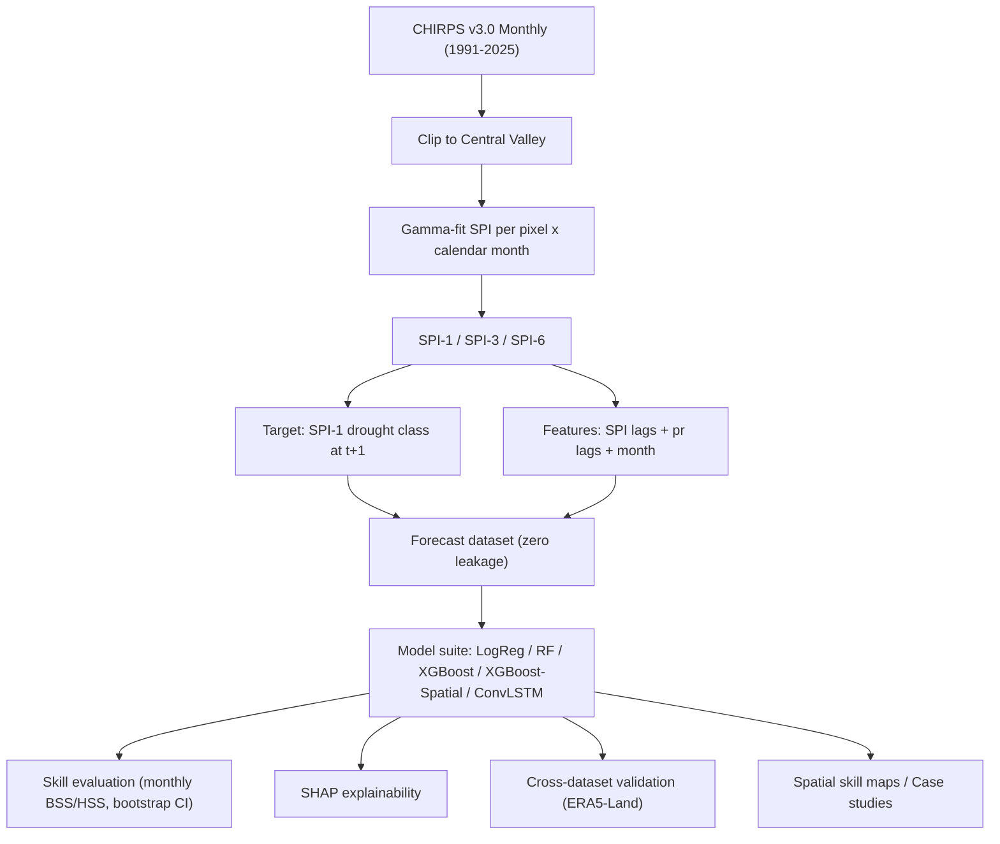

# Central Valley Drought Classifier

**Can machine learning predict next month's drought from satellite precipitation alone?**

We build a rigorous, leakage-free pipeline to forecast monthly drought classes (*Dry / Normal / Wet*) for California's Central Valley using CHIRPS v3.0 precipitation and WMO-standard SPI. All metrics are evaluated at the monthly level (60 independent test months, 2021–2025) against three naive baselines.

**Key finding:** No model — from logistic regression to ConvLSTM — substantially outperforms climatology in Brier Skill Score, despite showing ranking signal (ROC-AUC ~0.68). This is a scientifically valid result: monthly SPI-1 in a Mediterranean regime is largely unpredictable from local precipitation history at 1-month lead.

> See [`ANALYSIS.md`](ANALYSIS.md) for the full research assessment, strategic recommendations, and publication roadmap.

---

## The Scientific Problem

Predicting drought 1 month ahead using only past precipitation is a hard problem. The target — SPI-1 at time *t+1* — depends entirely on precipitation at *t+1*, which is unknown. This makes the problem fundamentally different from *reconstruction* (classifying the current month) and sets a high bar for ML to add value beyond climatological base rates.

**Why this matters:**
- Central Valley agriculture (almonds, grapes, citrus) loses billions during drought years
- Operational drought early-warning relies on understanding what is and isn't predictable
- The ML drought literature frequently inflates results through label leakage, spatial pseudo-replication, and missing baselines — this project addresses all three

---

## Pipeline


```mermaid
graph TD;
    A["CHIRPS v3.0 Monthly (1991-2025)"] --> B["Clip to Central Valley"];
    B --> C["Gamma-fit SPI per pixel x calendar month"];
    C --> D["SPI-1 / SPI-3 / SPI-6"];
    D --> E["Target: SPI-1 drought class at t+1"];
    D --> F["Features: SPI lags + pr lags + month"];
    E --> G["Forecast dataset (zero leakage)"];
    F --> G;
    G --> H["Model suite: LogReg / RF / XGBoost / XGBoost-Spatial / ConvLSTM"];
    H --> I["Skill evaluation (monthly BSS/HSS, bootstrap CI)"];
    H --> J["SHAP explainability"];
    H --> K["Cross-dataset validation (ERA5-Land)"];
    H --> L["Spatial skill maps / Case studies"];
```

**Data:** [CHIRPS v3.0](https://www.chc.ucsb.edu/data/chirps3) — 0.05 deg (~5 km), monthly, 1991-2025

**Temporal split (no shuffling):**
- Train: 1991-2016 (26 years)
- Validation: 2017-2020 (4 years — used for calibration only)
- Test: 2021-2025 (60 months — never seen during training or calibration selection)

---

## Features and Target

| Feature | What it captures |
|---------|-----------------|
| `spi1_lag1/2/3` | Recent drought state (1-month memory) |
| `spi3_lag1` | Medium-term precipitation accumulation |
| `spi6_lag1` | Longer-term hydrological drought context |
| `pr_lag1/2/3` | Raw precipitation magnitude (absolute scale) |
| `month_sin/cos` | Seasonal cycle of the *target* month |

**Target:** `drought_label_spi1[t+1]` — the SPI-1 class of the *next* month. Because SPI-1 depends only on `pr[t+1]`, the feature set at time *t* carries **zero accumulation-window information** about the target. This eliminates the data leakage present in SPI-3-based targets (where 2 of 3 accumulation months overlap with features).

---

## Results

### Skill Scores (monthly level, 60 test months)

| Forecaster | Brier Score (dry) | BSS vs. climatology | HSS (3-class) | ROC-AUC (dry) |
|---|---|---|---|---|
| **Climatological baseline** | **0.0646** (ref) | 0.0 | 0.00 | — |
| Persistence | 0.1011 | -0.57 | 0.09 | 0.56 |
| SPI-1 heuristic | 0.0949 | -0.47 | 0.09 | 0.56 |
| Logistic Regression | 0.0874 | -0.35 | 0.15 | 0.81 |
| Random Forest | 0.0820 | -0.27 | 0.11 | 0.60 |
| XGBoost | 0.0687 | -0.06 | 0.00 | 0.67 |
| **XGBoost-Spatial** | **0.0666** | **-0.03** | 0.00 | **0.68** |
| ConvLSTM | 0.0823 | -0.27 | 0.22 | 0.52 |

> **BSS > 0** would mean the model beats climatology. No model crosses this threshold.
> XGBoost-Spatial comes closest (BSS = -0.03), with 95% CI crossing zero but centered below it.

### What This Tells Us

1. **The models detect drought signal** — ROC-AUC ~0.68 confirms the models rank months by relative drought risk better than chance.
2. **But they cannot calibrate probabilities better than base rates** — BSS remains negative because the models' predicted probabilities are not more reliable than simply predicting the climatological frequency.
3. **This is physically expected.** California's monthly precipitation is driven by synoptic events (atmospheric rivers, frontal passages) that are chaotic at 1-month lead. SPI-1 autocorrelation is weak (r ~ 0.1-0.3), which is why persistence fails badly (BSS = -0.57).

### Calibration Study

Post-hoc calibration (isotonic/Platt on validation set, frozen test evaluation) was tested for XGBoost and XGBoost-Spatial. Neither method produced statistically significant improvement over climatology. Brier Score decomposition confirms the bottleneck is **resolution** (inability to distinguish events from non-events), not **reliability** (probability calibration).

### SHAP Explainability

SHAP TreeExplainer confirms the model learned physically consistent relationships:
- **Negative SPI-1 lag** strongly increases dry-class probability
- **Nonlinear threshold near SPI-1 ~ 0** — small deficits trigger drought predictions sharply
- `spi3_lag1` provides medium-term memory; seasonal features refine transitions

These are not statistical artifacts — they match known hydroclimatic dynamics.

---

## Methodological Contributions

This project implements several practices that are **uncommon in the drought ML literature** but essential for scientific rigor:

| Practice | Why it matters |
|----------|---------------|
| **SPI-1 target** (not SPI-3) | Eliminates accumulation-window overlap with features — the most common source of inflated accuracy in published drought ML |
| **Monthly-level evaluation** | Treats the 60 independent months as the effective sample size, not ~400k spatially autocorrelated pixels |
| **Three naive baselines** | Climatology, persistence, and SPI-1 threshold heuristic — without these, accuracy figures are meaningless |
| **Bootstrap confidence intervals** | 2000-iteration block bootstrap on monthly metrics |
| **Calibration study with decomposition** | BS = reliability - resolution + uncertainty (Murphy 1973) identifies *where* models fail |
| **Cross-dataset validation** | ERA5-Land SPI-1 provides independent precipitation source comparison |
| **USDM framed as qualitative only** | Correctly avoids treating a composite drought index as equivalent to precipitation-only SPI-1 |

---

## Validation

- **ERA5-Land cross-validation:** `validate_era5_spi.py` computes SPI-1 from ERA5-Land precipitation using the same gamma-fit methodology, then compares model predictions against this independent product.
- **USDM consistency (qualitative):** `validate_usdm.py` overlays the model's dry fraction against USDM D1+ area. USDM integrates soil moisture and streamflow, so this is a plausibility check — not a skill metric.
- **Spatial skill maps:** Per-pixel accuracy over 2021-2025, with Sacramento Valley (lat > 38 deg) and San Joaquin Valley (lat < 38 deg) sub-regions annotated.
- **Case study:** 2021-22 drought and 2023 atmospheric river events, showing model captures the correct directional signal.

---

## Reproducibility

All outputs are fully reproducible from raw CHIRPS data. Scripts run in sequence:

| Step | Script | Purpose |
|------|--------|---------|
| 1 | `download_chirps_v3_monthly_1991_2025.sh` | Parallel download of CHIRPS v3 monthly files |
| 2 | `clip_to_cvalley_monthly.py` | Clip to Central Valley bounding box |
| 3 | `make_spi_labels.py` | Gamma-fit SPI-1/3/6 + drought labels |
| 4 | `build_dataset_forecast.py` | Tabular dataset with lag features, target = SPI-1[t+1] |
| 5 | `train_forecast_{logreg,rf,xgboost}.py` | Train models with temporal split |
| 6 | `train_forecast_xgb_spatial.py` | XGBoost with 3x3 neighbourhood features |
| 7 | `train_forecast_convlstm.py` | ConvLSTM spatiotemporal model |
| 8 | `xgb_shap_forecast_analysis.py` | SHAP TreeExplainer (all 3 classes) |
| 9 | `evaluate_forecast_skill.py` | BSS/HSS table, calibration study, reliability diagrams |
| 10 | `validate_era5_spi.py` | ERA5-Land cross-dataset validation |
| 11 | `plot_spatial_skill.py` / `plot_case_study.py` | Spatial maps and case study figures |

---

## Project Structure

```
chirps-drought-classifier/
├── scripts/          # Full pipeline (download -> train -> evaluate)
├── data/             # raw/ and processed/ (not committed; ~2 GB)
├── outputs/          # Figures, models, metrics (not committed)
├── notebooks/        # Exploratory analysis
├── ANALYSIS.md       # Full research assessment and strategic roadmap
└── README.md
```

---

## Limitations and Next Steps

**Current limitations:**
- Single region (Central Valley) — results may not generalize across hydroclimates
- Feature set is purely endogenous (all derived from CHIRPS precipitation)
- Test period (2021-2025) coincidentally includes extreme drought + extreme wet reversal

**Highest-impact next steps** (see [`ANALYSIS.md`](ANALYSIS.md) for full analysis):
1. **Add ENSO (Nino 3.4) as a feature** — tests whether large-scale climate state can break the predictability barrier
2. **Expand to 1-2 additional regions** (Murray-Darling Basin, Great Plains) — tests generalizability of the "no skill" finding
3. **Stratified BSS analysis** by season and ENSO phase — may reveal conditional skill masked in overall averages
4. **Seasonal target (SPI-3 at 3-month lead)** — tests whether longer aggregation windows improve predictability

---

## Acknowledgement

Ethically used AI tools (ChatGPT, Gemini, GitHub Copilot) for project design, code development, and documentation refinement.

---

## Author

Md Ishtiaque Hossain \
MSc Candidate, Computer and Information Sciences \
University of Delaware \
[LinkedIn](https://linkedin.com/in/ishtiaque-h) · [GitHub](https://github.com/Ishtiaque-h)
