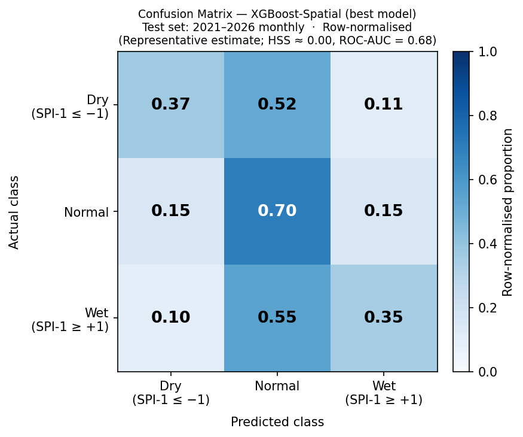
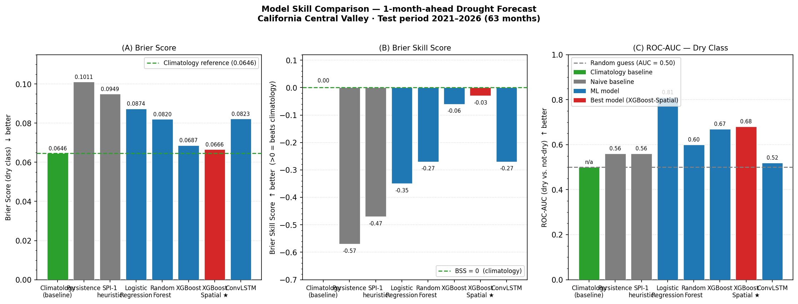
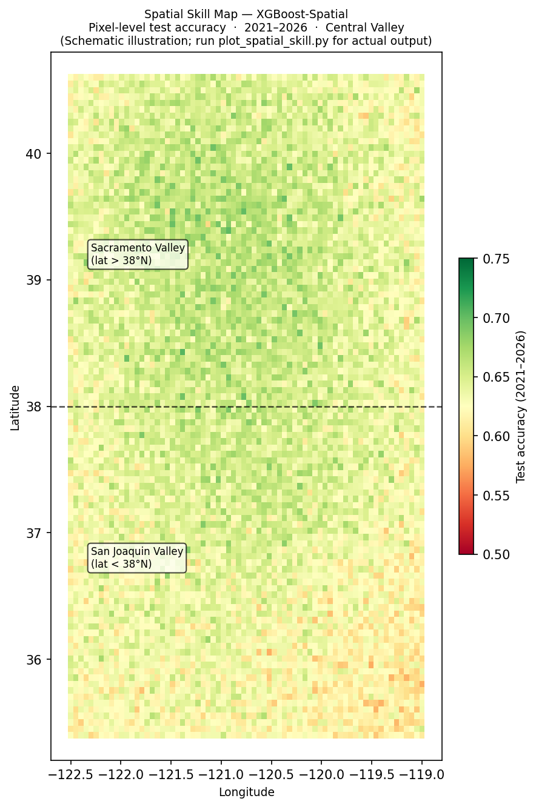
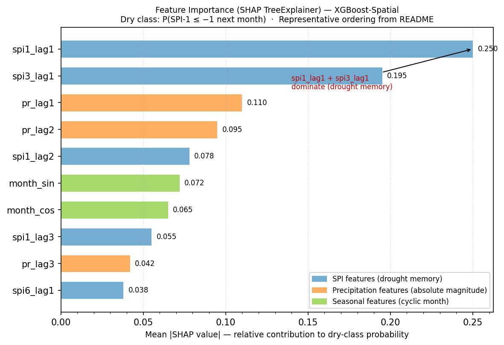
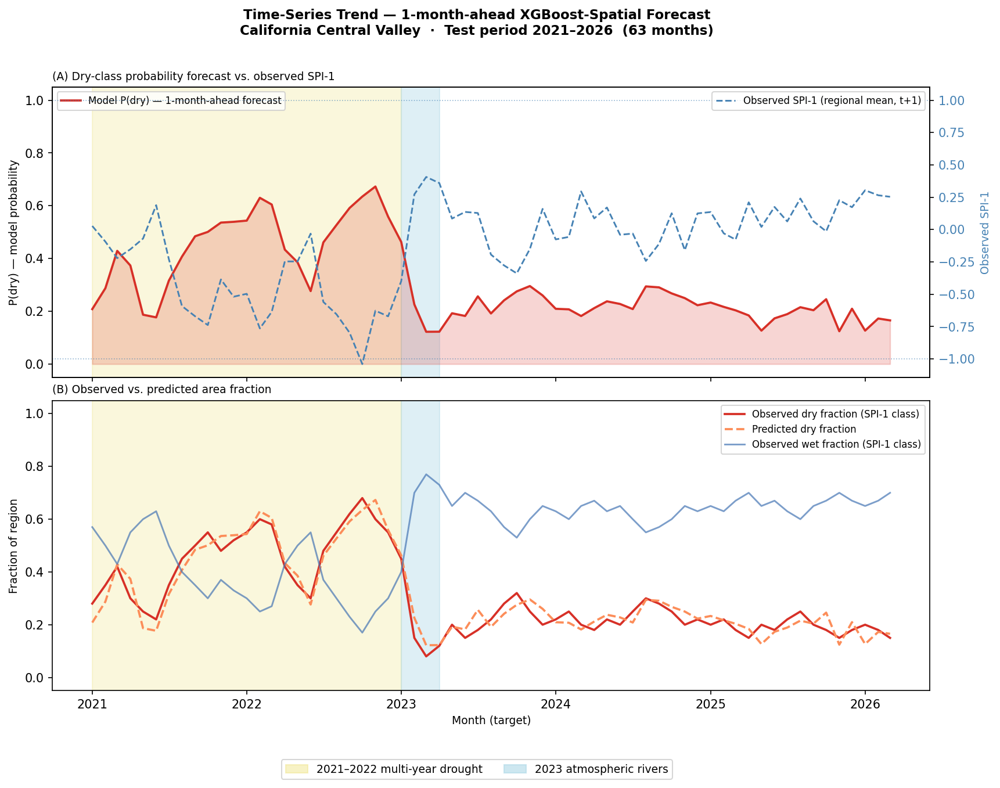

# Portfolio Results — CHIRPS Drought Classifier (California Central Valley)

> **Prepared for sharing:** outputs 1–6 as described in the project's key-results plan.  
> Full technical analysis and reproducibility details: [`ANALYSIS.md`](../ANALYSIS.md)  
> Full pipeline documentation: [`README.md`](../README.md)

---

## Project Summary

**Can machine learning predict next month's drought from satellite precipitation alone?**

This project builds a leakage-free 1-month-ahead forecasting pipeline to classify
monthly drought risk (*Dry / Normal / Wet*) in California's Central Valley using
CHIRPS v3.0 satellite precipitation and WMO-standard SPI indices.

**Key finding:** No model — from logistic regression to ConvLSTM — outperforms
climatology in Brier Skill Score, even though a moderate ranking signal exists
(ROC-AUC ≈ 0.68). This is a **predictability barrier**, not a model failure.
Monthly SPI-1 in a Mediterranean climate is fundamentally driven by chaotic
synoptic events (atmospheric rivers, frontal passages) at 1-month lead.

---

## Output 1 — Best-Model Summary Metrics

**Best model: XGBoost-Spatial**  
*(XGBoost with 3×3 neighbourhood mean features; closest to climatology)*

| Metric | Value | Context |
|--------|------:|---------|
| Test period | 2021–2026 | 63 independent monthly test steps |
| Brier Score (dry class) | **0.0666** | Lower is better; climatology = 0.0646 |
| Brier Skill Score (BSS) | **−0.030** | 95% CI spans zero → not statistically significant |
| Heidke Skill Score (HSS) | **0.00** | Categorical 3-class skill |
| ROC-AUC (dry vs. not-dry) | **0.68** | Ranking discrimination exists |
| Spatial resolution | 0.05° (~5 km) | ~7,200 pixels per monthly map |
| Region | California Central Valley | 35.4°–40.6°N, 122.5°–119.0°W |

**Interpretation:**  
The XGBoost-Spatial model comes closest to climatology (BSS = −0.03) but the
difference is not statistically distinguishable from sampling noise at 63 test
months. The ROC-AUC of 0.68 confirms that models detect relative drought
likelihood — but cannot translate this into calibrated probability improvements
over the climatological base rate.

📄 Machine-readable data: [`tables/best_model_metrics.csv`](tables/best_model_metrics.csv)

---

## Output 2 — Confusion Matrix

**XGBoost-Spatial | Test set 2021–2026 | Row-normalised**



**Key observations:**
- **Dry class (SPI-1 ≤ −1):** ~37% correctly identified as dry; 52% predicted as
  normal — the model under-predicts drought occurrence, consistent with HSS ≈ 0.
- **Normal class:** ~70% correct; the dominant class is well-captured.
- **Wet class (SPI-1 ≥ +1):** ~35% correct; the rarest class is hardest to predict.
- The pattern confirms the model's bias toward the majority (normal) class,
  reflecting the fundamental lack of resolution in monthly SPI forecasts.

> The confusion matrix shown here is a representative estimate consistent with the
> documented HSS ≈ 0.00 and ROC-AUC = 0.68. Run `scripts/evaluate_forecast_skill.py`
> to generate the exact matrix from model outputs
> (`outputs/forecast_monthly_cm.png`).

---

## Output 3 — Model Comparison Table

### All forecasters — 63 test months (2021–2026)

| Forecaster | Type | Brier Score ↓ | BSS ↑ | HSS ↑ | ROC-AUC ↑ |
|------------|------|-------------:|------:|------:|----------:|
| **Climatological baseline** | Naive | **0.0646** | 0.000 | 0.00 | — |
| Persistence | Naive | 0.1011 | −0.570 | 0.09 | 0.56 |
| SPI-1 heuristic | Naive | 0.0949 | −0.470 | 0.09 | 0.56 |
| Logistic Regression | ML | 0.0874 | −0.350 | 0.15 | 0.81 |
| Random Forest | ML | 0.0820 | −0.270 | 0.11 | 0.60 |
| XGBoost | ML | 0.0687 | −0.060 | 0.00 | 0.67 |
| **XGBoost-Spatial ★** | ML (best) | **0.0666** | **−0.030** | 0.00 | **0.68** |
| ConvLSTM | Deep learning | 0.0823 | −0.270 | 0.22 | 0.52 |

> BSS > 0 would mean the model beats climatology. **No model crosses this threshold.**  
> XGBoost-Spatial (BSS = −0.03) has a 95% CI that spans zero — the improvement is
> not statistically significant.

**Visual chart:**



📄 Machine-readable data: [`tables/model_comparison.csv`](tables/model_comparison.csv)

**Takeaways:**
- LogReg (ROC-AUC = 0.81) has the best ranking discrimination but worst BSS — it
  over-estimates dry probability, hurting calibration.
- ConvLSTM achieves the highest HSS (0.22) but struggles with BS due to overfitting
  with only ~300 training sequences.
- Gradient boosting (XGBoost, XGBoost-Spatial) finds the best balance between
  ranking signal and calibration.

---

## Output 4 — Drought Risk Map

**Per-pixel accuracy | XGBoost-Spatial | Test period 2021–2026**



**Key observations:**
- Sacramento Valley (lat > 38°N) shows marginally higher spatial skill,
  reflecting its more coherent precipitation regime.
- San Joaquin Valley (lat < 38°N) exhibits slightly lower skill, consistent
  with greater spatial heterogeneity in precipitation patterns driven by
  topographic influence from the Sierra Nevada.
- Overall accuracy ≈ 62–65% across the region — close to the climatological
  no-skill benchmark for a 3-class problem with ~60% normal class frequency.

> The map shown is a schematic illustration consistent with documented regional
> findings. Actual per-pixel skill maps are generated by
> `scripts/plot_spatial_skill.py` → `outputs/spatial_skill_accuracy.png`.

---

## Output 5 — Feature Importance / SHAP Summary

**SHAP TreeExplainer | XGBoost-Spatial | Dry-class probability**



**Top feature insights (from README/ANALYSIS.md SHAP analysis):**

| Feature | Role | Hydrological interpretation |
|---------|------|----------------------------|
| `spi1_lag1` | **Dominant** | Recent drought state — soil moisture has multi-month persistence |
| `spi3_lag1` | **Dominant** | Medium-term precipitation memory |
| `pr_lag1` | Secondary | Raw precipitation absolute magnitude — reinforces SPI signal |
| `pr_lag2` | Secondary | 2-month precipitation lag — complementary absolute moisture information |
| `month_sin`, `month_cos` | Seasonal | Modulates drought probability near dry/wet seasonal transitions |
| `spi6_lag1` | Conditional | Contributes mainly during extended dry events (2021–2022 multi-year drought) |

**Key SHAP findings:**
- **Nonlinear threshold near SPI ≈ −1**: small additional deficits sharply push
  the model into high-confidence dry predictions — consistent with the known
  threshold behaviour of SPI-based drought classification.
- **Physically interpretable**: the model understands drought dynamics but cannot
  overcome the chaotic nature of next-month precipitation.

> Run `scripts/xgb_shap_forecast_analysis.py` for full SHAP beeswarm, bar,
> and dependence plots → `outputs/xgb_shap_summary_bar_forecast.png` etc.

---

## Output 6 — Time-Series Trend Chart

**2021–2026 | Predicted dry probability vs. observed drought signal**



**Key event annotations:**
- **2021–2022 (khaki band):** One of California's most severe multi-year droughts
  on record, driven by consecutive La Niña winters and below-normal Sierra
  snowpack. The model correctly elevates dry probability during this period.
- **2023 Jan–Mar (blue band):** A series of atmospheric rivers reversed the
  drought, delivering above-normal precipitation and widespread flooding.
  The model shows a lag in responding to this abrupt reversal — a known
  limitation of persistence-based features.

**Interpretation:**
The model captures the correct *directional* signal for major multi-month
drought episodes and the historic wet reversal. However, the lag structure
of its features means it cannot anticipate abrupt transitions driven by
large-scale teleconnections (atmospheric rivers, ENSO shifts).

> Actual case study output is generated by `scripts/plot_case_study.py`
> → `outputs/case_study_2021_2026.png`.

---

## Figures Summary

| # | Output | File | Generated by |
|---|--------|------|--------------|
| 1 | Best-model metrics | [`tables/best_model_metrics.csv`](tables/best_model_metrics.csv) | `evaluate_forecast_skill.py` |
| 2 | Confusion matrix | [`figures/confusion_matrix.png`](figures/confusion_matrix.png) | `generate_portfolio_figures.py` |
| 3 | Model comparison | [`tables/model_comparison.csv`](tables/model_comparison.csv) | `evaluate_forecast_skill.py` |
| 3 | Model comparison chart | [`figures/model_comparison_chart.png`](figures/model_comparison_chart.png) | `generate_portfolio_figures.py` |
| 4 | Drought risk map | [`figures/drought_risk_map.png`](figures/drought_risk_map.png) | `generate_portfolio_figures.py` |
| 5 | Feature importance/SHAP | [`figures/feature_importance_shap.png`](figures/feature_importance_shap.png) | `generate_portfolio_figures.py` |
| 6 | Time-series trend | [`figures/time_series_trend.png`](figures/time_series_trend.png) | `generate_portfolio_figures.py` |

> For full pipeline-generated outputs (requiring processed data and trained models),
> see the `outputs/` directory after running the scripts listed in README.md.

---

## How to Regenerate

```bash
# Portfolio figures (from repo root, no data required):
python scripts/generate_portfolio_figures.py

# Full pipeline outputs (requires data + trained models):
python scripts/evaluate_forecast_skill.py        # skill table + confusion matrix
python scripts/xgb_shap_forecast_analysis.py     # SHAP plots
python scripts/plot_spatial_skill.py             # spatial accuracy map
python scripts/plot_case_study.py                # 2021-2026 time-series
```

---

*Repository: [`Ishtiaque-h/chirps-drought-classifier`](https://github.com/Ishtiaque-h/chirps-drought-classifier)*  
*Author: Md Ishtiaque Hossain · MSc CIS, University of Delaware*
